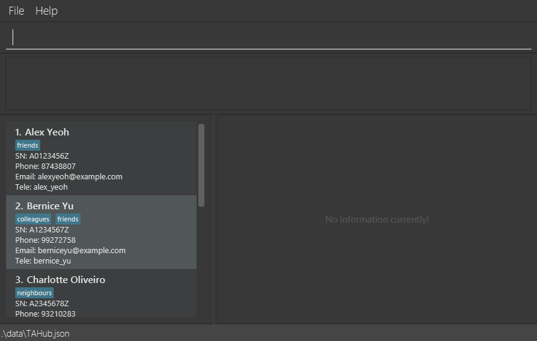

## Overview
ClientHub is a **Command Line Interface (CLI) contact management application**
built specifically for sales representatives based in Singapore.
Unlike spreadsheets or complicated Customer Relationship Management(CRM) Tools,
ClientHub provides a **fast, lightweight, and efficient way to track clients,
manage interactions, and monitor progress**, all with a CLI.

Our goal is to give sales representatives a **seamless client tracking experience**
so they can spend less time wrestling with messy tools and more time securing deals.

---

## Features
The current version of ClientHub includes the following core features:

- **Add client**: Create new client entries with details such as name, phone, company, email, address, status, products.
- **Delete client**: Remove clients who are no longer relevant.
- **View all clients**: Display all saved client entries at a glance.
- **Edit client details**: Edit the details of entries already in ClientHub.
- **Filter client list**: Find clients that match specifications stated.
- **Track client statuses**: Track onboarding progress of Client.
- **Undo last action**: Allow user to undo action that they accidentally made.
- **Redo action**: Allow user to redo action undone, in the scenario that they changed their mind.

---

## Planned Features
Beyond the MVP, ClientHub aims to support sales reps with additional productivity features such as:
- Importing contacts from Excel/CSV
- Exporting client lists to share with colleagues
- Adding detailed notes for each client

---

## Developer Information
- This project is written in **Java**, following **Object-Oriented Programming (OOP)** principles.
- This project is based on the AddressBook-Level3 project created by the [SE-EDU initiative](https://se-education.org).

---

## Getting Started
1. Ensure you have **Java 17** installed.
2. Download the latest `.jar` file from [here](https://github.com/AY2526S1-CS2103T-T14-2/tp/releases)
3. Copy the file to the folder you want to use as the home folder.
4. Open a command terminal and `cd` into the folder you put the `.jar` file in. Use `java -jar clienthub.jar` command to run the application.

---

## Documentation
- For detailed documentation on features, user guide, and developer guide, visit the [ClientHub Product Website](https://ay2526s1-cs2103t-t14-2.github.io/tp/index.html).
