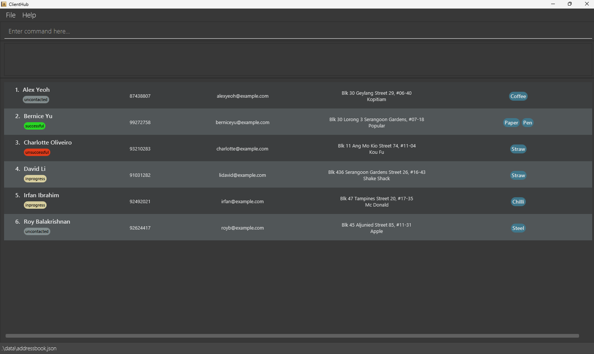
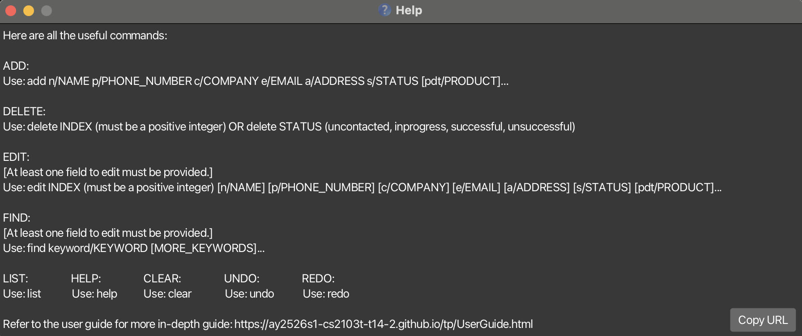
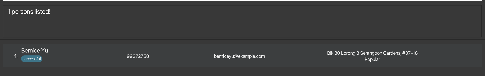

# ClientHub User Guide

## Introduction
ClientHub is a **Command Line Interface (CLI)** based _contact management application_
built specifically for sales representatives based in Singapore.
> ClientHub provides a **fast, lightweight, and efficient way to track clients, manage interactions, and monitor progress**.

<!-- * Table of Contents -->
<page-nav-print />

--------------------------------------------------------------------------------------------------------------------

## Getting Started
This guide will walk you through the **installation of ClientHub**, and **how to use it**.
<box type="tip" seamless>

**Tip:**

If you are ***new to ClientHub***
- Continue with the installation guide [below](#installation)

If you have ***already installed ClientHub***
- Head to the [command summary](#command-summary) section for a quick overview of all commands and their usage
- Read the [features](#features) section for more details on each command
- Browse the [FAQ](#faq) for quick answers
</box>

## Installation

1. Ensure you have **Java 17** installed.
<box type="tip" seamless>
Please refer to this <a href="https://se-education.org/guides/tutorials/javaInstallation.html">guide</a> for Java installation.
</box>

2. Download the latest `ClientHub.jar` file from [here](https://github.com/AY2526S1-CS2103T-T14-2/tp/releases)

3. Copy the file to the folder you want to use as the home folder.

4. Open a command terminal and `cd` into the folder from Step 3.

<box type="tip" seamless>

**Tip:**

Unsure how to navigate in the terminal?

If the `ClientHub.jar` file is in the folder `Desktop/ClientHub`:
- Type `cd Desktop/ClientHub` into the terminal
- You are on the right track if you see the following:
`C:\Users\YOUR_NAME\Desktop\ClientHub` on Windows or
`user@XXX ClientHub` on Mac
</box>

5. Use `java -jar clienthub.jar` command to run the application.

> A GUI similar to the one below should be seen
> 

6. Type the command in the command box and press Enter to execute it. e.g. typing **`help`** and pressing Enter will open the help window. 
   Some example commands you can try:

   * `list` : Lists all clients.

   * `add n/John Doe p/98765432 c/apple e/johnd@example.com a/John street, block 123, #01-01 s/uncontacted` : Adds a contact named `John Doe` to ClientHub.

   * `delete 3` : Deletes the 3rd client shown in the current list.

   * `clear` : Deletes all clients.

   * `exit` : Exits the app.

7. Refer to the [Features](#features) below for details of each command.

--------------------------------------------------------------------------------------------------------------------

## Features

<box type="info" seamless>

**Notes about the command format:** 

* Words in `UPPER_CASE` are the parameters to be supplied by the user. 
  e.g. in `add n/NAME`, `NAME` is a parameter which can be used as `add n/John Doe`.

* Items in square brackets are optional. 
  e.g `n/NAME [s/STATUS]` can be used as `n/John Doe s/successful` or as `n/John Doe`.

* Items with `…`​ after them can be used multiple times including zero times. 
  e.g. `[pdt/PRODUCT]…​` can be excluded (i.e. 0 times), `pdt/Fish`, `pdt/Chicken pdt/Fish` etc.

* Parameters can be in any order. 
  e.g. if the command specifies `n/NAME p/PHONE_NUMBER`, `p/PHONE_NUMBER n/NAME` is also acceptable.

* Extraneous parameters for commands that do not take in parameters (such as `help`, `list`, `exit` and `clear`) will be ignored. 
  e.g. if the command specifies `help 123`, it will be interpreted as `help`.

* If you are using a PDF version of this document, be careful when copying and pasting commands that span multiple lines as space characters surrounding line-breaks may be omitted when copied over to the application.
</box>

### Viewing help : `help`

Shows a message explaining how to access the help page.

Format: `help`

### Adding a person: `add`

Adds a person to ClientHub.

Format: `add n/NAME p/PHONE_NUMBER c/COMPANY e/EMAIL a/ADDRESS [s/STATUS] [pdt/PRODUCTS]…​`

* ClientHub will not allow user to add 2 entries with same Name and same Phone to prevent duplicate entries.
* Name field will only accept alphabetic characters and spaces.
* Phone number field is limited to 8 digits, starting with 3, 6, 8 or 9, as this application is Singapore based.
* Status field must be either uncontacted, inprogress, unsuccessful or successful
* If the optional `[s/STATUS]` field is not specified, it will be defaulted to `uncontacted`

<box type="tip" seamless>

**Tip:** A person can have any number of products (including 0)
</box>

Examples:
* `add n/John Doe p/98765432 c/Chargrill Bar e/johnd@example.com a/311, Clementi Ave 2, #02-25 s/uncontacted pdt/Chicken`
* `add n/John Doe p/98765432 c/Chargrill Bar e/johnd@example.com a/311, Clementi Ave 2, #02-25 s/uncontacted pdt/Chicken pdt/Fish`

### Listing all persons : `list`

Shows a list of all persons in ClientHub.

Format: `list`

### Editing a person : `edit`

Edits an existing person in ClientHub.

Format: `edit INDEX [n/NAME] [p/PHONE] [c/COMPANY] [e/EMAIL] [a/ADDRESS] [s/STATUS] [pdt/PRODUCTS]…​`

* Edits the person at the specified `INDEX`. The index refers to the index number shown in the displayed person list. The index **must be a positive integer equal or lesser than the number of contacts you have in the list, N,** 1, 2, 3, …​, N.
* At least one of the optional fields must be provided.
* Existing values will be updated to the input values.
* You can remove all of a specified person’s products by typing `edit INDEX pdt/`.

<box type="warning" seamless>

**Caution:**
Editing the product field of a client completely deletes all existing products tagged to the client,
replacing it with your requested edits i.e adding of products is **not cumulative**.
</box>

Examples:
*  `edit 1 p/91234567 e/johndoe@example.com` Edits the phone number and email address of the 1st person to be `91234567` and `johndoe@example.com` respectively.
*  `edit 2 n/Betsy Crower pdt/` Edits the name of the 2nd person to be `Betsy Crower` and clears all existing products.
*  `edit 3 pdt/Chicken` Clears all current products tagged to the 3rd person, replacing it with `Chicken` only.

### Locating persons by any attribute: `find`

Finds persons through characteristics containing any of the given substring in the attribute.

Format: `find keyword/KEYWORD [MORE_KEYWORDS]`

* Keyword can be either `n/ c/ s/ pdt/`.
* At least one of the optional fields must be provided.
* The search is case-insensitive. e.g `hans` will match `Hans`
* Substring of the keyword will be matched e.g. `Han` will match `Hans`

Examples:
* `find n/John` returns `john` and `John Doe`
* `find c/po` returns `Bernice Yu` 
  

<box type="tip" seamless>

**Tip:** `list` can be used after `find` to view the original list of clients again
</box>

### Deleting a person : `delete`

Deletes the specified person or every person with the specified status from ClientHub.

Format 1: `delete INDEX`

* Deletes the person at the specified `INDEX`.
* The index refers to the index number shown in the displayed person list.
* The index **must be a positive integer less than the number of contacts in the list** 1, 2, 3, …​, N

Format 2: `delete STATUS`

* Deletes every person currently holding the specified `STATUS`.
* The status refers to the onboarding progress of the person.
* The status **must be either uncontacted, inprogress, unsuccessful or successful**

Examples:
* `list` followed by `delete 2` deletes the 2nd person in ClientHub.
* `find n/Betsy` followed by `delete 1` deletes the 1st person in the results of the `find` command.
* `find n/John` followed by `delete unsuccessful` deletes every person holding the "unsuccessful" status,
regardless of whether the person is in the results of the `find` command.

### Clearing all entries : `clear`

Clears all entries from ClientHub.

Format: `clear`

### Undo previous command: `undo`

Format: `undo`

Undo the previous command that you have entered.

<box type="info" seamless>

If you have done nothing and have no command to undo, the command will not do anything.
</box>

### Redo previous command undone: `redo`

Format: `redo`

Redo the command you have just undone.

<box type="info" seamless>

If you have not undone any other command, this command will not do anything.
</box>

### Exiting the program : `exit`

Exits the program.

Format: `exit`

### Saving the data

ClientHub data are saved in the hard disk automatically after any command that changes the data. There is no need to save manually.

### Editing the data file

ClientHub data are saved automatically as a JSON file `[JAR file location]/data/clientbook.json`. Advanced users are welcome to update data directly by editing that data file.

<box type="warning" seamless>

**Caution:**
If your changes to the data file makes its format invalid, ClientHub will discard all data and start with an empty data file at the next run.  Hence, it is recommended to take a backup of the file before editing it. 
Furthermore, certain edits can cause ClientHub to behave in unexpected ways (e.g., if a value entered is outside the acceptable range). Therefore, edit the data file only if you are confident that you can update it correctly.
</box>

--------------------------------------------------------------------------------------------------------------------

## FAQ

**Q**: How do I transfer my data to another Computer? 
**A**: Install the app in the other computer and overwrite the empty data file it creates with the file that contains the data of your previous ClientHub home folder.

**Q**: I entered a command but nothing happened. What should I do? 
**A**: Check if your command follows the exact format shown in the [Features](#features) section. ClientHub ignores extra spaces but requires all parameters to be correctly prefixed (e.g., n/, p/, e/, etc.).

**Q**: I accidentally deleted a Client, can I undo that mistake? 
**A**: Yes you can. Refer to Undo command in the [Features](#features) section.

--------------------------------------------------------------------------------------------------------------------

## Known issues

1. **When using multiple screens**, if you move the application to a secondary screen, and later switch to using only the primary screen, the GUI will open off-screen. The remedy is to delete the `preferences.json` file created by the application before running the application again.

--------------------------------------------------------------------------------------------------------------------

## Command summary

Action     | Format, Examples
-----------|----------------------------------------------------------------------------------------------------------------------------------------------------------------------
**Add**    | `add n/NAME p/PHONE_NUMBER c/COMPANY e/EMAIL a/ADDRESS s/STATUS [pdt/PRODUCT]…​`   e.g., `add n/James Ho p/82349123 c/Google e/jamesho@example.com a/123, Clementi Rd, 1234665 s/successful pdt/Paper`
**Delete** | `delete INDEX` OR `delete STATUS`  e.g., `delete 3` OR `delete unsuccessful`
**Edit**   | `edit INDEX [n/NAME] [p/PHONE_NUMBER] [c/COMPANY] [e/EMAIL] [a/ADDRESS] [s/STATUS] [pdt/PRODUCT]…​`  e.g.,`edit 2 n/James Lee e/jameslee@example.com`
**Find**   | `find [n/NAME] [c/COMPANY] [s/STATUS] [pdt/PRODUCT]`  e.g. `find n/James`, `find n/ja`
**List**   | `list`
**Undo**   | `undo`
**Redo**   | `redo`
**Clear**  | `clear`
**Help**   | `help`
